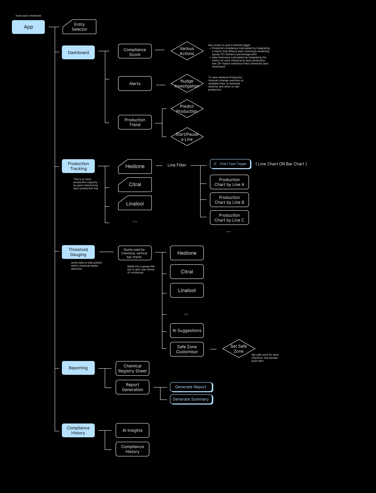
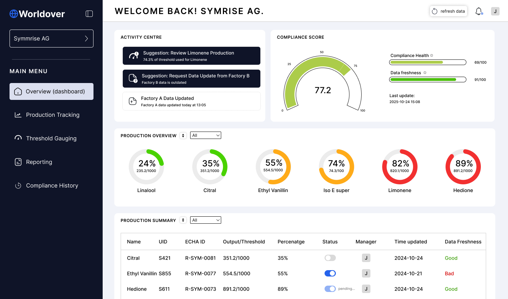
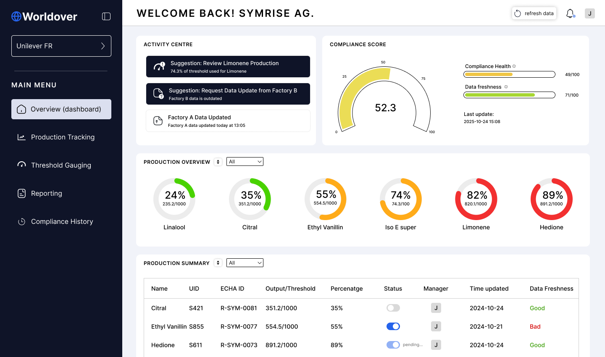
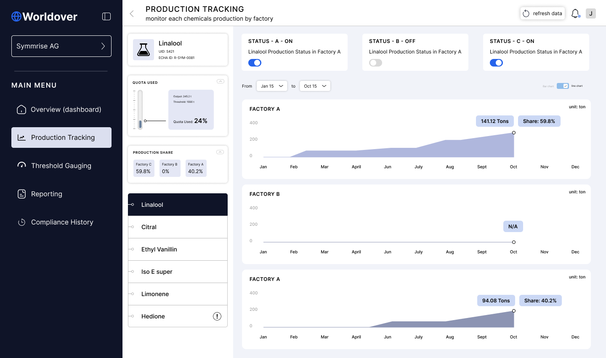
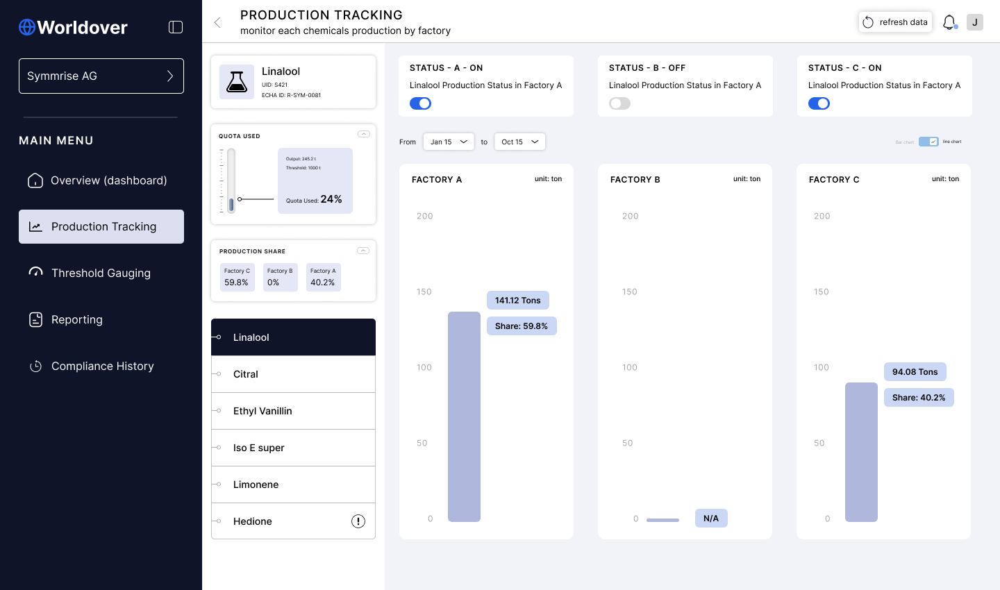
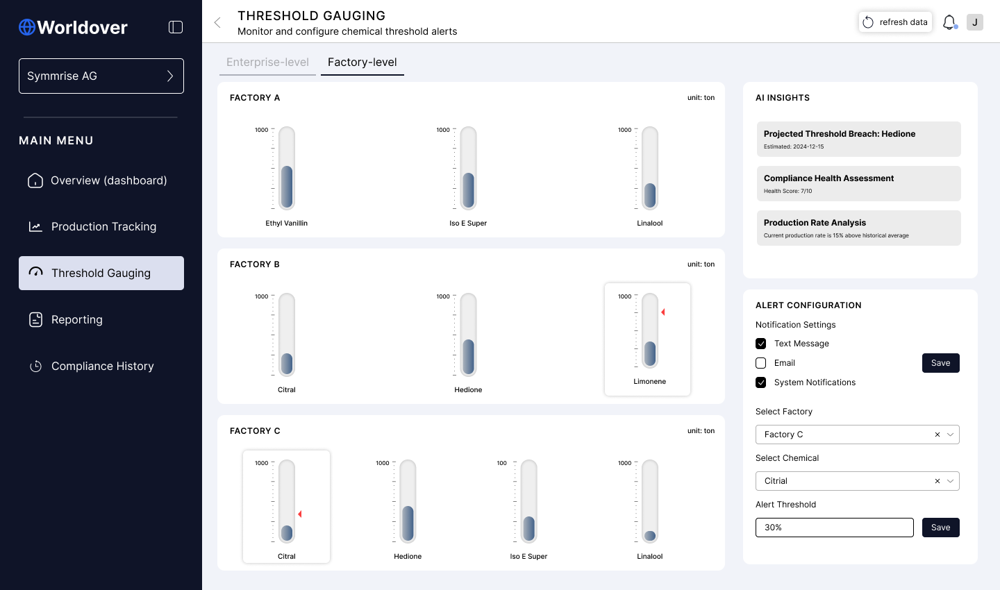
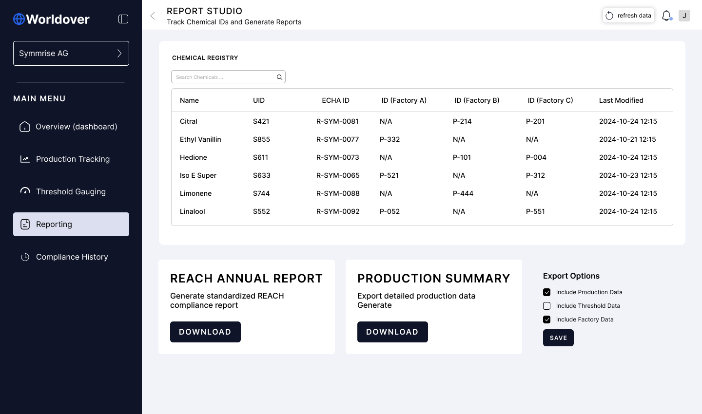

Back

2026

# Turning compliance data into a Risk Command workflow

Worldover helps teams manage compliance risk across legal entities, factories, production thresholds, plant ownership, evidence, and reporting deadlines.

I worked on a one-week product case to clarify the workflow and produce a high-fidelity prototype. The aim was not to decorate a dashboard. It was to show how the product could help founders, operators, and compliance teams understand what needs attention first.

The business value was product clarity. A buyer or investor needs to see more than tables: they need to understand how Worldover detects pressure, explains cause, and moves a team toward reporting readiness.

## Problem

Because compliance work spans production data, threshold rules, documents, and ownership, users could see many signals without knowing which one should drive the next action.

That creates a commercial problem as well as a usability problem. If the product cannot explain the risk story quickly, it becomes harder to sell the workflow to non-technical leaders.

I mapped the product around the jobs operators need to complete: dashboard triage, production tracking, threshold guarding, reporting, and compliance history.

## 1 — Separate operational modes

I split the experience into Risk Command, Production Tracking, Threshold Guarding, Reporting, and Compliance History. Each area answers a different business question.

Risk Command answers what needs action now. Production Tracking shows which entity or factory is creating pressure. Threshold Guarding manages alert rules. Reporting shows whether the team can export the required material.

This made the product easier to explain because each tab has a clear job rather than acting as another place to store data.

Risk Command brings the main alert, compliance score, production summary, and entity table into one scannable operating view.

## 2 — Make entity risk readable

The command view shows the active issue and the likely driver, so the user does not have to infer the problem from production numbers alone.

Entity selection changes the score, risk text, production facts, alerts, and report state. The prototype behaves like a product rather than a static presentation.

From a business perspective, the screen helps a founder understand the business state without reading every table or knowing the compliance model in detail.

Entity switching changes the risk state and supporting production facts, which helps reviewers judge the product logic rather than only the visual style.

## 3 — Give production review its own space

Production data is not just background detail. It is often the cause of the compliance pressure, so I moved it into a dedicated tracking view with entity filters, factory cards, trend charts, and output summaries.

The design lets an operator compare factories, spot unusual shares, and understand whether the risk comes from volume, ownership, or missing context.

From a business perspective, this makes the dashboard more defensible. Worldover can show not only that a company is at risk, but why that risk exists.

Production Tracking separates entity and factory analysis from the main command view, reducing dashboard density while preserving investigation depth.

Factory share views help operators compare where production pressure is coming from before deciding what to audit or escalate.

## 4 — Connect alerts and reports to readiness

Threshold Guarding turns alert configuration into an operational control surface. Users can see which factories are close to a limit, adjust alert recipients, and define when a warning should trigger.

Reporting then closes the loop. Instead of treating export as an isolated button, the screen shows report history, production summaries, and the actions required before a team can submit with confidence.

The result is a clearer product story: detect risk, understand cause, notify the right people, and prepare the evidence.

Threshold Guarding makes alert setup part of the workflow, not a hidden settings task.

Reporting shows what can be exported and what still needs attention before submission.

## Delivery and results

In the first pass, the prototype covered the core screens needed to judge the workflow: command overview, entity states, production tracking, threshold guarding, and reporting readiness.

I kept the visual system calm and operational because the domain is serious. The interface needed enough hierarchy for urgent decisions without turning compliance into a visually noisy enterprise dashboard.

The safest result claim is prototype clarity. The work gives Worldover a stronger product narrative for internal review, sales conversations, and future build planning.

## So what?

This project is about judgement before screens: find the real decision, separate the jobs, and make the next action visible.

For a compliance SaaS product, that matters because trust is built through explanation. The interface needs to show what changed, why it matters, who owns it, and whether the team is ready to report.
